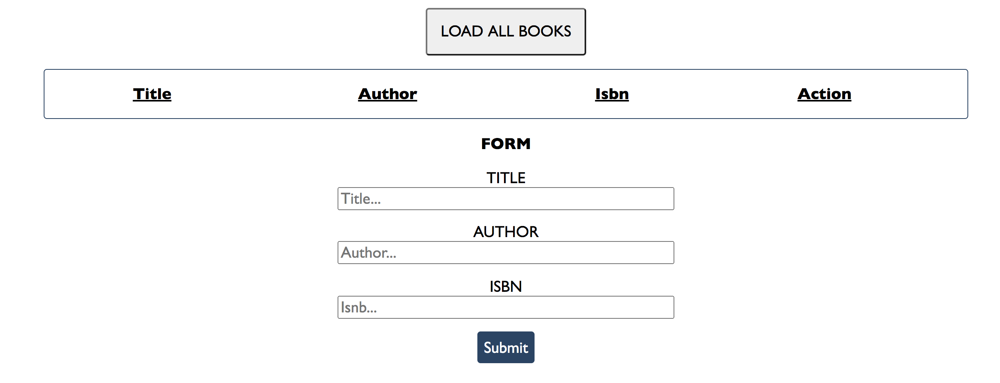
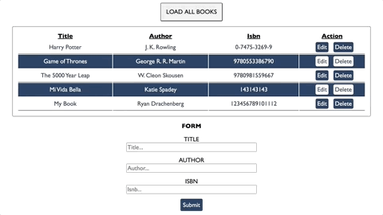
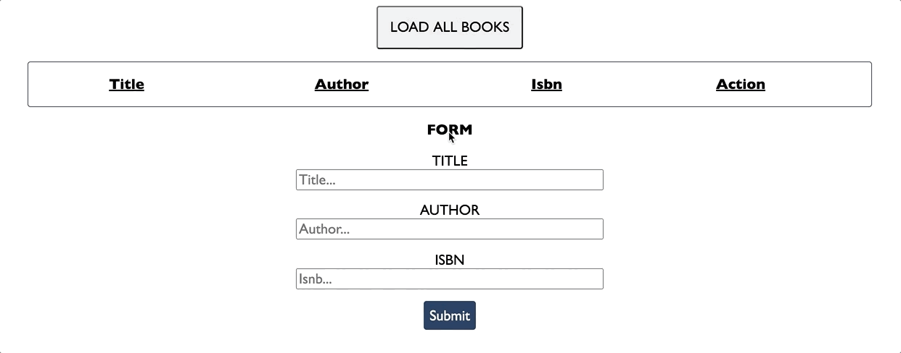
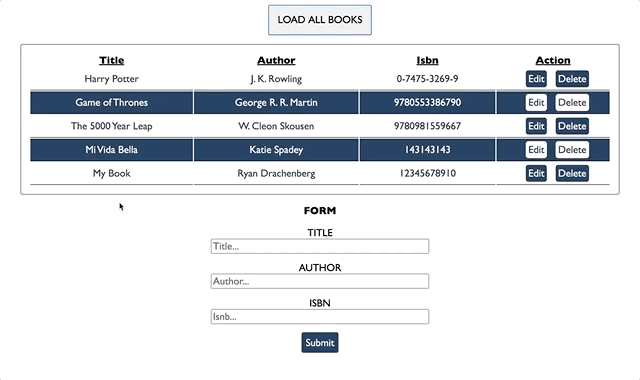

# booksREST
Tasked with creating a Books REST service with Kinvey DB storage and custom authorization request headers

    
     
    
    
    
    
    

    

    

    📦booksREST
    ┣ 📂img
    ┃ ┣ 📜books.png
    ┃ ┣ 📜booksCreate.gif
    ┃ ┣ 📜booksDelete.gif
    ┃ ┣ 📜booksUpdate.gif
    ┃ ┗ 📜loadbooks.gif
    ┣ 📜README.md
    ┣ 📜app.js
    ┣ 📜index.html
    ┗ 📜styles.css

## Create / Add Book

 

    

## Read / Load Books

 

    

## Update / Update Book

 

    

## Delete / Delete Book

 

    

